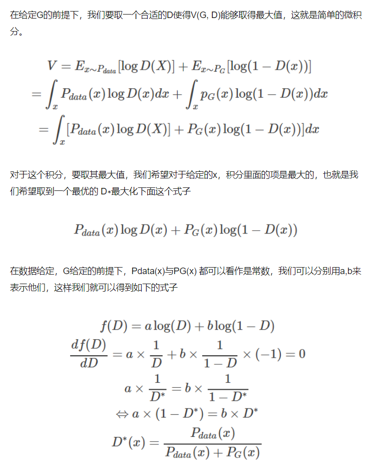

## GAN

- ### 数据分布 **$p(x)$**

	GAN 就是想通过神经网络学习到目标的数据分布**$p(x)$**（复杂未知），原因是使用传统的极大似然估计无法对未知的数据分布进行有效的估计。
    
    - GAN的基本结构

		
    
- ### GAN 原理

	- GAN的生成器原理

		- 目标
		
        GAN想通过一个生成器（也就是神经网络）学习到复杂的数据分布$P_{data}(x)$
        
        - 算法思路

			- 接收一个噪声输入，经过一个可学习的神经网络，输出一个预测分布$P_G(x)$
			- 建立一种评价损失，极小化 $P_{data}(x)$ 与 $P_G(x)$ 的距离$Div$
			
            	$$G^* = argmin_G [Div(P_G, P_{data})]$$
        - 注意：
        	1. 噪声输入的分布可以来自任意分布，原因是神经网络的强拟合能力，足能够将这个输入分布进行改变
        	2. **这种距离相对比较难以定义**，原因$P_{data}(x)$ 与 $P_G(x)$是没有任何先验的
        	3. **GAN的思路**是基于 采样思想（大数定理），引入判别器，有效对样本的分布来源进行区分，通过判别器的区分结果判定$P_{data}(x)$ 与 $P_G(x)$的分布相似性（**所以GAN必须同时有生成器和判别器**）

	- GAN的判别器原理

		- 目标
		
        	通过一个有效的判别器能够判定 数据 $x$ 服从的分布是$P_{data}(x)$ （真实）还是 $P_G(x)$（假的）
            
        - 算法

			一个判别应该是**一个二分类的分类器**，所以核心是损失函数的设计
            
            $$V(D,G) = E_{x-P_{data}}[logD(x)] + E_{x-P_G}[log(1-D(x))]$$
            公式含义：
            - $x-P_{data}$ 时，判别器分值越高，即$D(x) -> 1$，即最大化 $E_{x-P_{data}}[logD(x)]$
            - $x-P_{G}$ 时，判别器分值越低，即$D(x) -> 0$, 即最大化 $E_{x-P_G}[log(1-D(x))]$
         
        - 判别器与生成器的联系

			- 一个好的判别器应该是
			
            	$$D^* = argmax_D [V(D,G)]$$
           	
            - 基于一个好的判别器，有效对两个分布的一致性进行判断，作为对分布距离的定义，就有

				$$G^* = argmin_G [argmax_D [V(D,G)]]$$
                
      **这就是最终的 $GAN$ 目标损失函数，一个好的$G^*$, $D^*$ 应当满足**

		$$argmin_G{G} argmax_D{D} V(D,G) =argmin_G{G} argmax_D{D} E_{x-P_{data}}[logD(x)] + E_{x-P_G}[log(1-D(x))]$$

	公式解析：
        - $D(x)$ 表示对 数据 $x$ 是否来自真实分布$P_{data(x)}$ 的判别，取值$[0,1]$
        -  $E_{x~P_{data(x)}}[logD(x)]$表示真实数据的判别损失
        -  $E_{x~P_{z(x)}}[log(1-D(G(z)))]$表示假数据的判别损失

		由上述推导引出的 GAN 网络 训练方式
        -  固定G，训练D，需要损失最大化，即真实数据的判别损失越小（$D(x) -> 1$），假数据的判别损失越大（$D(G(z)) -> 0$）
        -  固定D，训练G，需要损失最小化，即假数据的判别损失越小$D(G(z)) -> 1$）

	- 总结

		**生成器用来生成接近真是分布的样本（拟合真实分布），判别器用来判别生成器的预测分布与真实分布的距离。**
        
- ### GAN的数学性质
	
	-  基于 $GAN$ 的目标损失函数优化 $GAN$,等价于最小化真实分布与生成分布的 **JS** 散度 （相对熵）
		
        $$V(D,G) = E_{x-P_{data}}[logD(x)] + E_{x-P_G}[log(1-D(x))]$$
		- 求解最优判别器 $D^* = argmax_D [V(D,G)]$

			令 $\frac{\partial V}{\partial D} = 0$
            
            有 
            	
             $$D^* = \frac {P_{data(x)}} {P_{data(x)} + P_G(x)}$$
            
            详细推导：
            
        - 求解最优生成器 $$

			代入 $D^*$ 到 $V$中, 推导$G^* = argmin_G [V(D^*,G)]$
            
            
            
            最终得到：
            
            $$argmin_G [V(D^*,G)] = -2log2 + 2JS(P_{data} || P_G)$$

- ### 从数学角度推导GAN的学习算法		

	训练算法步骤：
    $D$, $G$ 的构造以及初始化（实践中，**$D$, $G$ 表现为深度神经网络**）
    
    - **step 1**: 通过抽样获取样本，以样本$\{x_i\}_i^n$的分布**近似** $P_{data}(x)$ ,以及 来随机分布 $P_z(z)$ 的输入样本 $\{z_i\}_i^n$
    - **step 2**: 基于初始化的生成器 $G$，生成样本 $\{x'_i\}_i^n$ 近似分布 $P_{G}(x')$， 即$P_{G}(G(z))$
    - **step 3**: 固定生成器 $G$ ，训练判别器 $D$ (最大化判别器)
		
		**基于大数定律（大样本均值近似真实均值）**，有
        
        $$V(D,G) = E_{x-P_{data}}[logD(x)] + E_{x-P_G}[log(1-D(x))] \approx \frac {1}{n} \sum_{i=1}^n log(D(x_i)) + \frac {1}{n} \sum_{i=1}^n log(1 - D(x'_i))$$
        
        基于上述目标函数使用梯度算法优化 $D$ 中的参数 $\theta_D$
        
        $$\theta_D = \theta_D + \eta \frac {\partial V(D,G)}{\partial \theta_D}$$
        
   	这里求解得到的往往是局部最优值 $D^*$
    
    - **step 4**: 固定判别器$D$  ，训练生成器 $G$ (最小化生成器)
		
        注意：此时更新 $G$，会导致 $V(D,G)$ 发生变化，导致前步骤求得的最优估计已经改变（最值偏移），所以一般都是训练多次 step 3， 再进行 step 4，此时找到的 $G^*$ 也是近似的
  
		**同样基于大数定律（大样本均值近似真实均值）**，有
        
        $$V(D,G) = E_{x-P_{data}}[logD(x)] + E_{x-P_G}[log(1-D(x))] \approx \frac {1}{n} \sum_{i=1}^n log(D(x_i)) + \frac {1}{n} \sum_{i=1}^n log(1 - D(G(z_i)))$$
        
         同样基于上述目标函数使用梯度算法优化 $G$ 中的参数 $\theta_G$
         
         $$\theta_G = \theta_G - \eta \frac {\partial V(D,G)}{\partial \theta_G}$$
         
         这里求解得到的往往是局部最优值 $G^*$
         
  因为训练算法对数学原理的各种近似原因，会导致 $GAN$ 一般需要重复上述 $4$ 个步骤多次进行迭代才有局部最优（训练时间长）