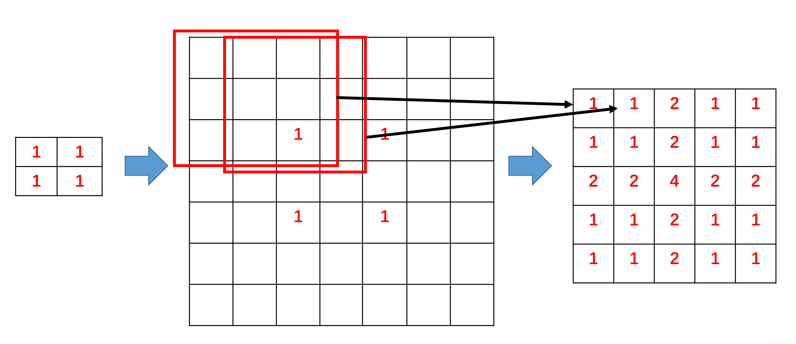

## DCGAN

- 思想

	基于 **CNN** 网络构建判别器和生成器，生成器依赖 **ConvTranspose** 作为网络基本层，判别器是普通的卷积网络
    
- 转置卷积

	通过对输入进行 padding 后的卷积计算结果  
    
    - $kernel = 3,  stride = 1$的转置卷积

		
        
        
    - $kernel = 3,  stride = 2$的转置卷积    

		
        
        
- DCGAN 的改进

	- 生成器和判别器不使用 **pooling** 层，使用 stride 卷积替代
	- 使用 **BN** 操作
	- 生成器中除了最后一层使用 **TanH** 作为激活函数，其余层采用 **ReLU**
	- 判别器则仅用 **LeakyReLU**        