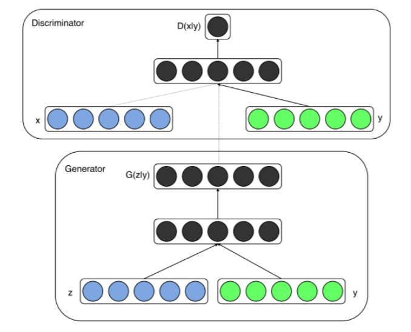

## Conditional GAN

- 应用：图像风格转换

	通过图像预处理获取约束条件，从而指导CGAN生成需要风格的目标图像，如图像边缘化、图像去马赛克等。
	
    
- 条件生成对抗网络思想

	
	
    所谓条件，就是除了原始 GAN 的输入，还需要将约束的条件 $y$ 输入生成器和判别器。目的是要求生成器按条件 $y$ 生成相应的图片，如果生成器生成 不符合条件 $y$ ，判别器也要判别为不合格。
    
- CGAN 的损失函数

	$$min_{G} max_{D} V(D,G) = E_{x-P_{data}(x)}[logD(x|y)] + E_{z-P_{z}(z)}[log(1-D(G(z|y)))]$$
     - $x$ 表示真实图像，$z$ 表示随机噪声输入
     - 经过预处理后的约束条件 $y$   

- CGAN训练原理
	
    **整体流程仍然是先固定生成器来训练判别器，让判别器有一个 “好的标准”，然后再固定判别器来训练生成器**

	- Step1：获取正面数据：真实图像$x_i$，约束条件如图像的对应灰度图$y_i$，组成**真实数据$(x_i,y_i)$**（一般可以是concat或者add操作）
	- Step2：生成噪声数据（可为图像模糊数据）$z_i$，加上约束条件后构成**负面数据$(z_i,y_i)$**
	- step3：将真实数据和负面数据输入判别器，训练判别器最大化目标函数 $V(D,G)$；固定判别器，将负面数据输入生成器，最小化目标函数$V(D,G)$

- CGAN 的应用场景

	- ColorGAN

		- 网络特点

			- 目的：将线条图像转为彩色图像

			- 判别器和生成器采用 DCGAN 网络的变体

			- 训练逻辑

			```python
                1. 获取线条图像 edge_image(阈值化);
                2. 获取模糊图像 blur_image(blur);
                3. 通过合并图像构建输入 combine_image  = concat(edge_image, blur_image)
                4. 通过生成器生成图像为   generate_image = G(combine_image)
                5. 构建真实图像输入 real_to_d = concat(real_image, combine_image)，设定标签为真
                6. 构建 fake 图像输入 fake_to_d =  concat(generate_image, combine_image)，设定标签为假
                7. 对判别器优化：real_to_d 判真 fake_to_d 判真
                8. fake_to_g = concat（generate_image_1, combine_image）
                9. 对生成器优化：fake_to_g 判真
            ```
    
    	- ColorGAN 扩展思路 

			- 图像去马赛克
			- 图像去雾
			

			
