 		## 循环一致性GAN

- 循环一致性

	- 循环一致性想解决的问题

		由于 GAN 网络复杂时，生成的图像内容与输入图像无关，循环一致性想要解决 **如何让生成的图像内容与输入的图像内容相关联**
        
    - 循环一致性的核心思想

		原始输入 $A$ 通过生成器 $G_{ab}$ 获得图像 $B$ 后，可以获得与图像 $A$ 相同 domain 的图像 $C$ ，最终保证 $A$ 与 $C$ 一致

- **CycleGAN图像合成网络**

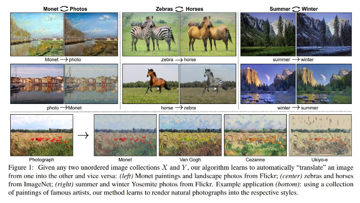

- 数据集准备

    两组数据集准备，实现一类数据向另一类数据进行转换

- 整体网络结构

    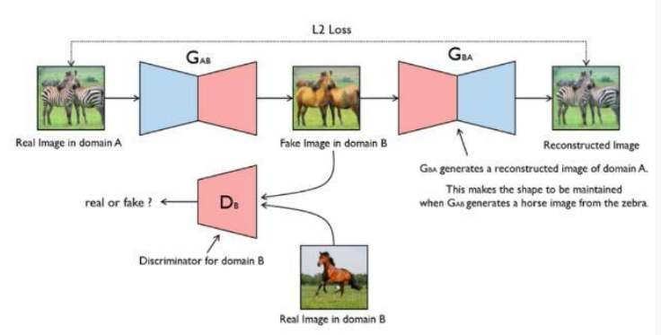

    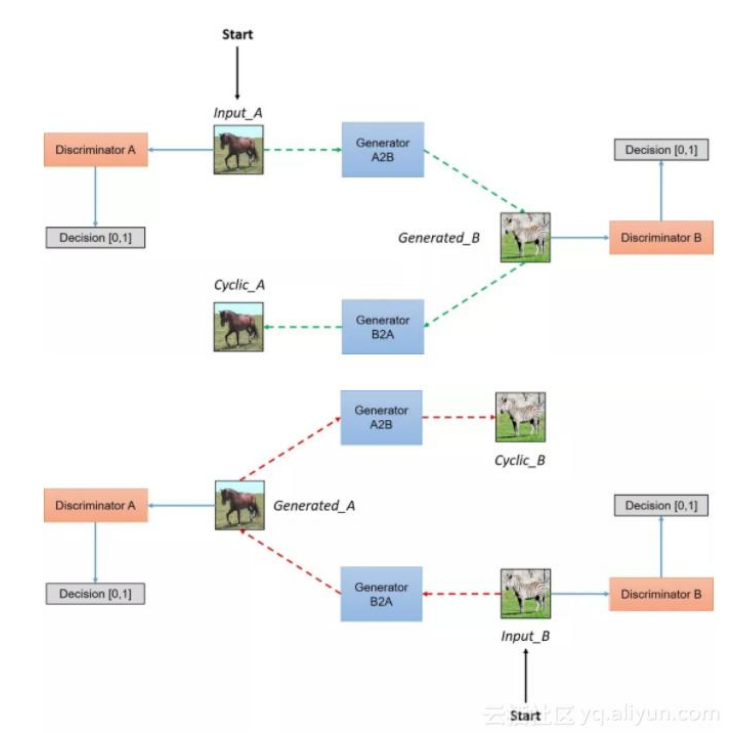

    - 学习转换与还原的网络
    - 沿着channel方向进行归一化 
    - 生成器主要由ResNet + 反卷积 + 卷积 输出与输入大小相同的数据 
    - 判别器主要是 卷积 + norm + leakyrelu ，最终输出单层特征图

- 判别器网络

    PatchGAN

    - 输出一个$N \times N$的矩阵，基于感受野计算损失

- 损失函数设计以及数学原理（**体现循环一致性**）

	- 表示定义

		$G$ - $Domain$ $X$ 中的图像 转成  $Domain$ $Y$ 中的图像 生成器
        
        $F$ - $Domain$ $Y$ 中的图像 转成  $Domain$ $X$ 中的图像 生成器
        
        $D_{X}$ - 判断 图像 是否属于 $Domain$ $X$ 且真实图像 的 判别器
        
        $D_{Y}$ - 判断 图像 是否属于 $Domain$ $Y$ 且真实图像 的 判别器
        
    - 循环一致性损失

		从 $Domain$ $X$ 中的图像转为 $Domain$ $Y$ 的图像有：
        
        $$x => y = G(x) => F(G(x)) \approx x$$
        
        从 $Domain$ $Y$ 中的图像转为 $Domain$ $X$ 的图像有：
        
        $$y => x = F(y) => G(F(y)) \approx y$$
        
        则循环一致性损失函数为：
        
        $$L_{cyc}(G,F) = E_{x-P_{data}(x)}[||F(G(x)) - x||_{p}] + E_{y-P_{data}(y)}[||G(F(y)) - y||_{p}]$$
        
  - 总损失函数

	- 普通 GAN 损失函数：
    
        对抗训练 $G，D_Y$

        $$L_{GAN}(G,D_{Y}, X, Y) = E_{y-P_{data}(y)}[logD_Y(y)] + E_{x-P_{data}(x)}[log(1-D_Y(G(x)))]$$
    
    - 最终损失函数：
    
        $$ L(G,F,D_X,D_Y) = L_{GAN}(G,D_{Y}, X, Y) + L_{GAN}(G,D_{X}, Y, X) + \lambda L_{cyc}(G,F)$$
        
- CycleGAN 的创新点

	- 使用 $Instance Normalization$ 替代 $Batch Normalization$
		
        - $IN$ 只针对单张图像进行标准化操作，$BN$ 对一批图像进行标准化
        - 只计算单张图像，效率高
        - $BN$ 容易让多张图像相互影响，容易生成模糊图像

	- 目标损失函数使用 $LSGAN$ 平方差损失替代传统的 $GAN$ 损失

		由于传统 GAN 损失生成图像质量不高并且在模型训练时不稳定，所以使用 **平方差** 损失替代      
        
        $$L_{LSGAN}(G,D_{Y}, X, Y) = E_{y-P_{data}(y)}[|D_Y(y)|^2] + E_{x-P_{data}(x)}[(1-D_Y(G(x)))^2]$$
        
        - 使用 Sigmoid 函数不关注数据与决策边界较远的距离，仅仅是优化到接近于$0$的位置，导致生成图像质量不高
        - 优化 LSGAN 等价于优化 皮尔森卡方散度

		$$2CG = \int_x \frac {(2P_g(x) - (P_d(x) + P_g(x)))^2}{P_d(x) + P_g(x)}dx$$
        
    - 生成器使用残差网络，保存了图像的语义
    - 使用缓存历史图像训练判别器

		将历史生成图像和当前轮生成图像聚集，训练时从中随机选择一张图片  

- **StarGAN人脸风格转换**		

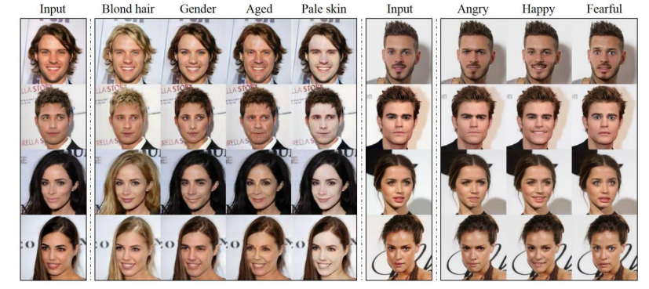

只用单一的GAN完成基于多任务的GAN网络

- StarGAN的基本思路
	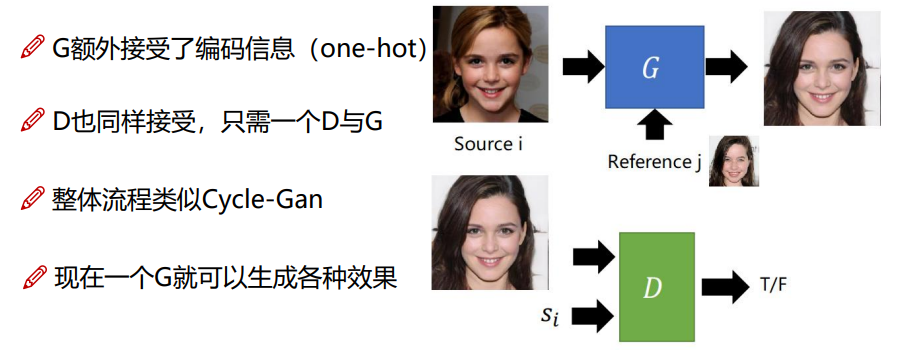
	
	- 基于输入的编码信息对不同人物进行区分
	- 核心思想：**约束条件 + 循环一致性**

- StarGANv1的整体流程

	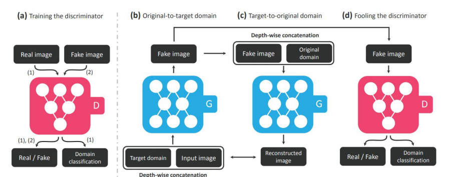
    
    - 类似cycleGan的思路，还原图片进行比较
    - 判别器不仅判别真假，还要判别属于类型风格
    - 训练算法流程

		a. 训练判别器 D，将 **real img** 和 **fake img** 同时输入 判别器，判别器需要输出图像的真假，同时判断图像来自哪个 **Domain**
        
        b. 训练生成器 G，与 CGAN 类似，输入 图像同时输入需要转换的 domain（类似 CGAN 约束条件）
        
        c. 循环一致性过程。将生成的 fake 图像和 原始 domain 输入，重建之前 GAN 的输入图像，最小化二者损失
        
        d. 将 b 生成的 fake 图像 输入 判别器 D，判别器输出 图像的是否真实以及所属的域，并进行损失计算
        
- domain 约束条件的表示

	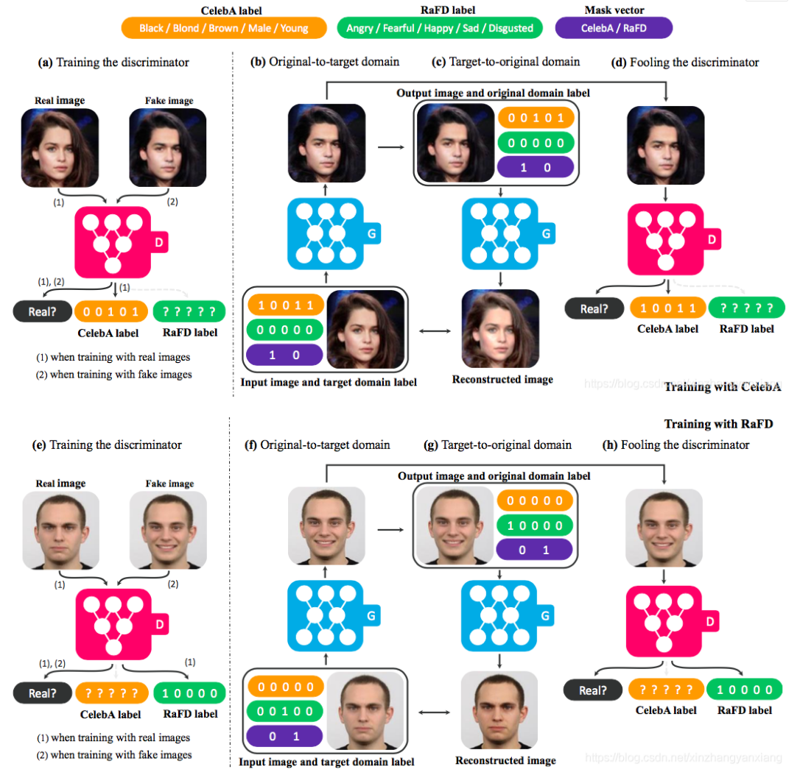      
    
    - 采用 one-hot 编码确定 domain 的特征表示
    - 如图最上方 CelebA label ： 分为 Black / Blond / Brown / Male / Young，target domain 为 $[1,0,0,1,1]$ 表明生成 黑色头发 年轻男性，这个就是 mask vector

- StarGANv2的整体流程
	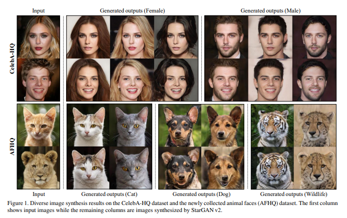

	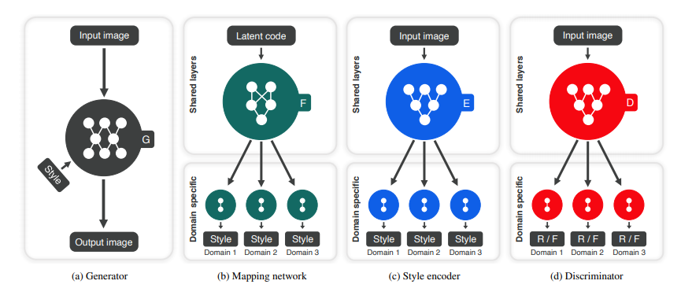
	- 改变编码思想
	
    	- 使用Mapping网络获取输入图像以及随机向量，输出64维作为风格向量
    	- encoder获取图像输入，输出64维编码向量
    	- 判别器针对不同风格输出两个真假结果

- 损失函数设计

	- 生成网络对抗损失

		$$L_{adv} = E_x[log[D_{src}(x)]] + E_{x,c}[log[1 - D_{src}(G(x,c))]]$$
        
        生成器最小化该损失；判别器最大化该损失；生成器需要输入图像和 domain 向量

	- 判别器的 domain 向量损失

		$$L^r_{cls} = E_{x,c'}[-log[D_{cls}(c'|x)]]$$
        
        - $c'$ 表示真实图像所在的 domain 向量
        - 对于判别器而言需要最小化这个向量
        
	- 生成器 domain 向量损失：

		$$L^f_{cls} = E_{x,c}[-log[D_{cls}(c | G(x,c))]]$$
        
        - $c$ 表示生成器的目标 domain 向量，对于生成器而言，需要最小化该损失
        
	- 循环一致性损失

		$$L_{rec} = E_{x,c,c'}[|x - G(G(x,c),c')|]$$
        
    - 判别器损失函数

		$$L_D = -L_{adv} + \lambda_{cls}L^r_{cls}$$
        
    - 生成器损失

		$$L_G = L_{adv} + \lambda_{cls}L^f_{cls} + \lambda_{rec}L_{rec}$$   

- 基本网络结构

	- 生成器

		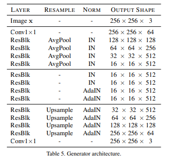
        
	 	- 使用Instance Norm 

	- mapping_Net

		

		将初始化的随机向量编码
   	
    - 判别器

		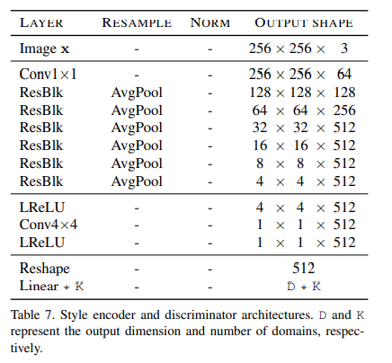

