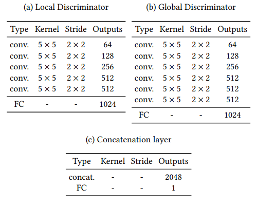

## 对抗生成网络

**基本的GAN**

- GAN的应用

	- 图像风格转换

	  

	- 超分辨率重构

		

	- 图像修复与补全
	
    	- 解决遮挡问题的一种思路

- GAN基本原理

	
    
    - 生成器的输入是一个随机向量
    - 真实数据源于训练集的随机选择
    - 判别器对真假数据进行二分类判别

- 损失函数设计

	$$min_{G} max_{D} V(D,G) = E_{x~P_{data(x)}}[logD(x)] + E_{x~P_{z(x)}}[log(1-D(G(z)))]$$
    
    -  $E_{x~P_{data(x)}}[logD(x)]$表示真实数据的判别损失
    -  $E_{x~P_{z(x)}}[log(1-D(G(z)))]$表示假数据的判别损失
    -  固定G，训练D，需要损失最大化，即真实数据的判别损失越小，假数据的判别损失越大
    -  固定D，训练G，需要损失最小化，即假数据的判别损失越小
    
- GAN的网络训练方法

	- Step1： 使用随机参数初始化生成器与判别器
	- Step2：训练流程
        - 固定生成器，训练判别器
        	-  输入随机向量，生成器前向传播，生成假数据
        	-  从真实数据中选择真实图片
        	-  进入判别器，通过对真实数据预测高分，假数据预测低分，训练
		- 固定判别器，训练生成器
			- 输入随机向量，通过生成器获取假数据
			- 将假数据输入判别器，获取判别结果，依据判别损失，训练生成器

	- Step3： 重复上述流程.
	
**Condition GAN网络**    
- 损失函数设计

	$$min_{G} max_{D} V(D,G) = E_{x~P_{data(x)}}[logD(x|y)] + E_{x~P_{z(x|y)}}[log(1-D(G(z)))]$$
     - 加入了外部条件约束$y$

- CGAN训练原理

	- Step1：获取正面数据：真实图像$x_i$，约束条件如图像的对应灰度图$y_i$，组成真实数据$(x_i,y_i)$（一般可以是concat或者add操作）
	- Step2：生成噪声数据（可为图像模糊数据）$z_i$，加上约束条件后构成负面数据$(z_i,y_i)$
	- 按照GAN的训练思路来训练

- CGAN的使用意义

	通过图像预处理获取约束条件，从而指导CGAN生成需要风格的目标图像，如图像边缘化、图像去马赛克等。

**CycleGAN图像合成网络**

- 数据集准备

    两组数据集准备，实现一类数据向另一类数据进行转换

- 整体网络结构

    

    

    - 学习转换与还原的网络
    - 沿着channel方向进行归一化 
    - 生成器主要由ResNet + 反卷积 + 卷积 输出与输入大小相同的数据 
    - 判别器主要是 卷积 + norm + leakyrelu ，最终输出单层特征图

- 判别器网络

    PatchGAN

    - 输出一个$N \times N$的矩阵，基于感受野计算损失

- 损失函数设计

	- MSE loss 计算G_AB和G_BA的还原loss（L1Loss）

**StarGAN人脸风格转换**

只用单一的GAN完成基于多任务的GAN网络

- StarGAN的基本思路
	
	
	- 基于输入的编码信息对不同人物进行区分

- StarGANv1的整体流程

	
    
    - 类似cycleGan的思路，还原图片进行比较
    - 判别器不仅判别真假，还要判别属于类型风格

- StarGANv2的整体流程
	

	
	- 改变编码思想
	
    	- 使用Mapping网络获取输入图像以及随机向量，输出64维作为风格向量
    	- encoder获取图像输入，输出64维编码向量
    	- 判别器针对不同风格输出两个真假结果

- 损失函数设计

	- cycle loss
	- 多样性loss，不同的随机向量输入，输出不同的编码风格
	- 相同的随机向量的编码损失

- 基本网络结构

	- 生成器

		
        
	 	- 使用Instance Norm 

	- mapping_Net

		

		将初始化的随机向量编码
   	
    - 判别器

		
		
**StarGAN-VC2声音风格转换**

- 输入

	1. 声音数据（$bn\times 1 \times 35 \times 128$）
		- 35为特征个数、128位指定特征维度
	2. 原始标签编码
	3. 目标标签编码

- 数据集

	VCC2016 VCC2018
    
- 预处理特征处理

	- 流程：
	
    	连续语音->预加重->加窗口分帧->FFT->MEL滤波器组->对数运算-> DCT

	- 16KHZ重采样
	- 预加重：补偿高频信号，让高频信号权重更大，保留更多信息
	- 分帧：类似时间窗口，得到多个特征段

- 声音特征参数

	- 基频特征（F0）：声音可以分解成不同频率的正弦波，最低的频率为基频
	- 频谱包络：分帧后的自徐磊，对每个子序列进行傅里叶变换，得到频率振幅图
	- Aperiodic参数：基于F0和频谱包络计算得到
	- MFCC（梅尔倒谱系数）：
		- FFT将语音转换到频域，MEL滤波器变换得到频率特征更能反映人类听觉效果

		$$f_{mel} = 2595\cdot log(1+\frac {f}{700Hz})$$
        
 - 网络模型

	- 生成器

		
        
        - 输入时提取好的特征，输出是编码后的特征
        - 引入1D卷积与2D卷积
        - 引入了Instance Norm以及GLU
         
        	- Instance Norm

				

				每个特征图针单独进行norm计算，仅仅保留内容，去除特色
                
            - Adaptive Instance Norm

				添加额外的FC层学习类似batch norm的偏移系数 $\gamma$/$\beta$  
        - 用stride cov替代Pooling 
		- PS（Pixelshuffle） 特殊的reshape操作

		

	- 判别器
		
        
		- GSP层：将一个特征图压缩成一个点

			- (b,c,h,w) -> (b,c)

**超分辨率重构SRGAN**

- 数据集准备

	- 低分辨率图像与高分辨率图像一一对应
 
- 网络结构

	- 生成网络

		

		通过卷积神经网络从低分辨率小图生成高分辨率大图
        
    - 判别网络

		
		判别生成图像与原本真实数据相同
        
 - Loss损失函数

	- 最终 MSE Loss 计算生成图像与原始图像的
	- 使用VGG 16获取特征图的MSE Loss进行细节重构
	- GAN Loss

**GAN图像补全**

- 网络输入与输出

	输入：RGB图像，二进制掩码（需要填充的区域以1填充）输出：RGB图像
    
    mask表示表示需要修补的区域，值为0和1，大小与输入RGB相同

- 网络结构

	
    
    - Encoding + Decoding结构
    - 橙色卷积表示空洞卷积
    - 判别网络分为局部判别网络和全局判别网络，只在训练时有用

	
    
    

- 损失函数

	- MSE损失

	- 判别网络训练 GAN损失

- 训练方式

	

	- 先训练主干网络的MSE损失
	- 然后结合判别网络一同训练